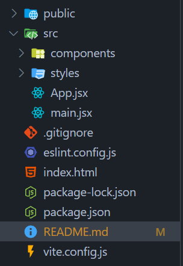
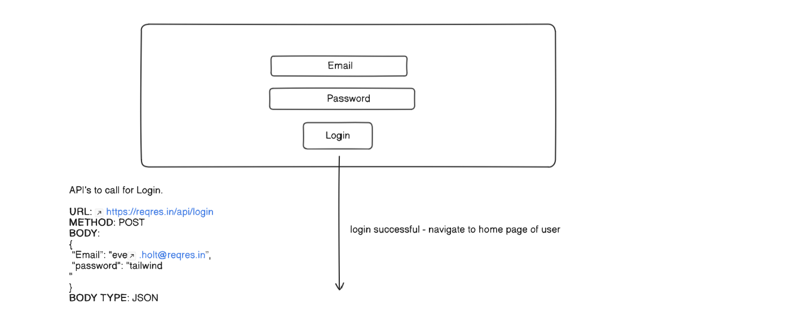
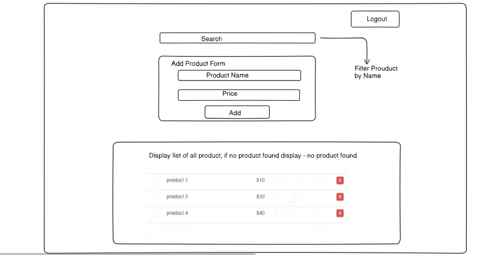

[Live App](https://stirring-salamander-9432b7.netlify.app)

# React App

A react application with functionality of login & logout, adding product, listing product list & filter product by product name. For database localStorage has been used.

# Tech Stack

HTML, CSS, JavaScript, React, JSX, Vite, NPM, localStorage

# Folder Structure

# Setup guild on local environment

## Clone Git Repo

Enter this command on your terminal: git clone <repository_url>

## Install NPM Packages and Dependencies

After you are done with cloning this git repository to your local machine, move to the root folder of cloned repositoy (use cd command) & run this command to install dependencies: npm install

## Start Development Server

From root folder run this command to start development server: npm run dev
Follow Instructions on Your Terminal to Check To Access Running App on Specific Port.

### Note: For login use test email and test password given on login page of application.

# Application Routes

/ : home page when logged in else login page

/login : login page

/anythingElse : error page

# Simple High Level Design

